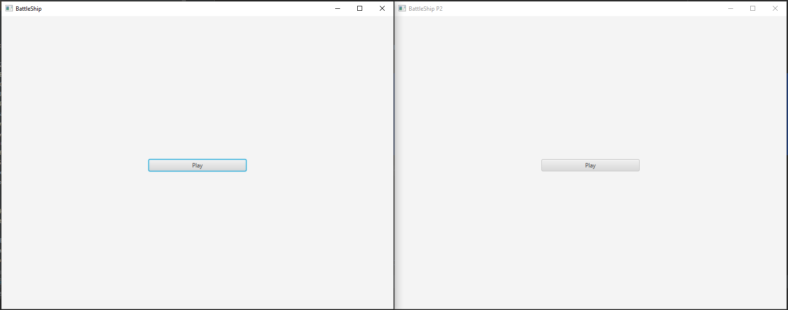
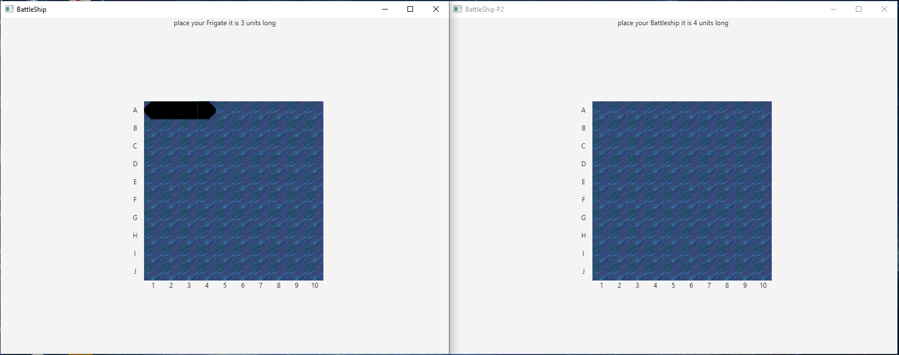
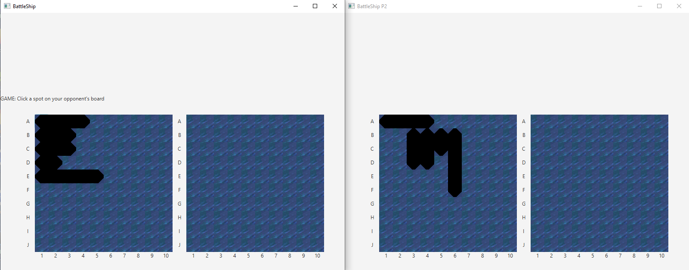
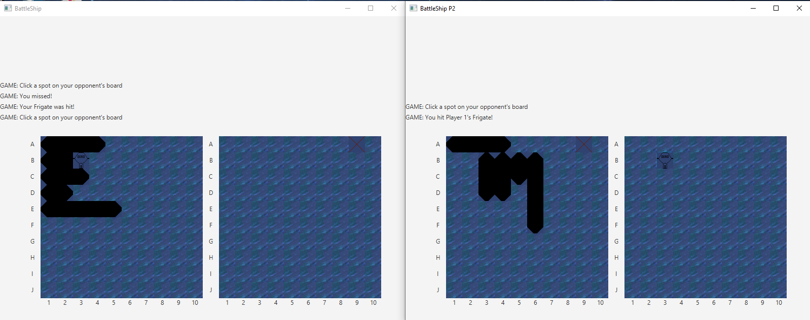
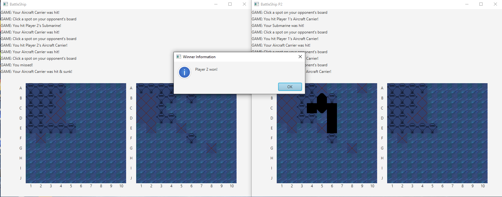

# Final group assignment for csci2020u - Multiplayer BattleShip Game

**Collaborators:
Samuel Jones, Abdulwasay Mansoor And Nicholas Coles**

This is a functional Battleship game.  A server that allows two users to play against each other without seeing the other players board.
Each client allows the user place their ships, then allows them to attack turn by turn until one user has sunk all the other players ships.
This program has a GUI that is aesthetic and simple to follow by reading the prompts.

To Run On The Same Machine:
1. Compile Server.java using JRE 15.
2. Compile Client.java using JRE 15 and JavaFX.
3. Compile Client2Test.java using JRE 15 and JavaFX.
4. Run Server.java using JRE 15.
5. Run Client.java using JRE 15.
6. Run Client2Test.java using JRE 15.

To Run On Separate Machine:
1. Compile Server.java using JRE 15 On One Of The Machine.
2. Compile Client.java using JRE 15 On Both Machines.
3. Run Server.java using JRE 15.
4. Run Client.java using JRE 15.
5. Run Client2Test.java using JRE 15.

To Play:
1. Press "play" on both of the clients
2. Place your ships following the prompts
3. Click the other player's board and try to hit their ship
4. Have Fun!!

